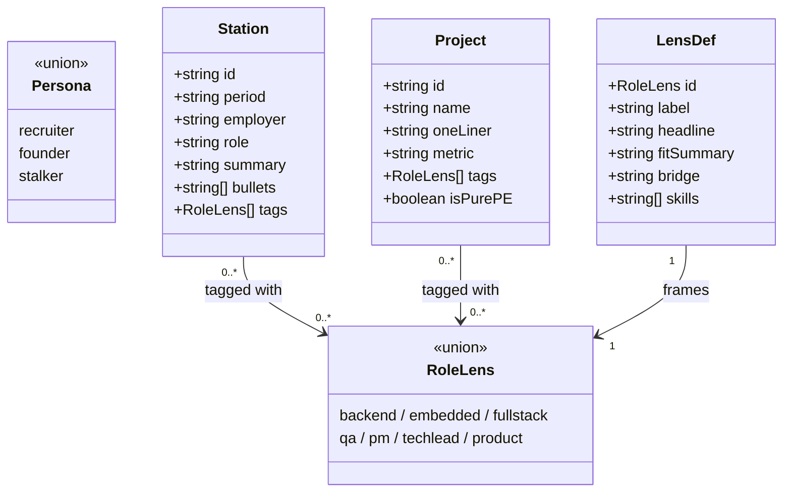
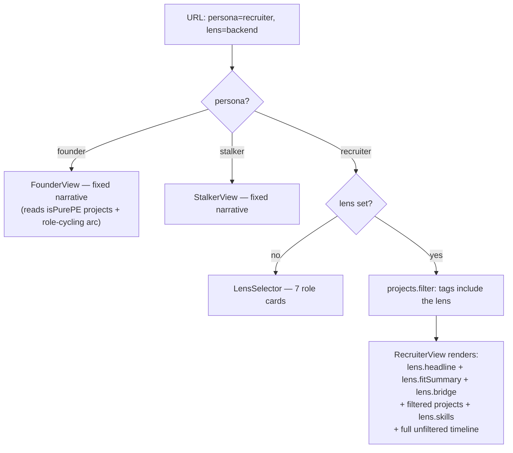
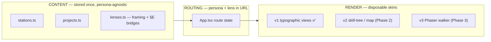

# ADR-0003: Content data model — persona-agnostic storage, tag-filtered + framing-centralised at render

← [ADR index](../ADR.md)

**Status:** Accepted (2026-06-20)
**Drivers:** no wasted work (build the brain once) · ship fast · CV-grade honesty (§A/§E)
**Constrained by:** [ADR-0001](adr-0001.md) (content-first, three layers) · [ADR-0002](adr-0002.md) (React + TS, typed modules)
**Feeds:** [ROADMAP.md](../ROADMAP.md) Phases 0–3

## Context

[ADR-0001](adr-0001.md) commits to three decoupled layers and states the rule for the **Content**
layer in one line: *"persona-agnostic at storage, persona-filtered at render."* That ADR decided the
layer exists; it did not decide the **shape** of the data inside it. This ADR does.

The shape has to satisfy four pressures that pull against each other:

- **One source, many views.** The same career must render as a recruiter's role-filtered story, a
  founder's "every hat" narrative, a casual visitor's backstory — and later as a skill-tree (Phase 2)
  and a Phaser walker (Phase 3). Per [ADR-0001](adr-0001.md), *"never rewrite the content model to
  change a skin."*
- **Cheap to extend.** The recruiter persona alone needs **7 role lenses** today, with more likely.
  Adding a lens, or a project, must not mean editing the whole dataset.
- **Honest by construction.** Every field is outward-facing copy bound by the honesty rules
  (§A no invented facts; §E name the stack gap + the transferable bridge). The model must give those
  rules *a place to live* rather than leaving them as prose discipline.
- **No infrastructure.** Ship-fast ([ADR-0002](adr-0002.md)) rules out a CMS or content API. The data
  is part of the build.

The naive answer — write a tailored page per audience — fails the first two pressures immediately:
three (then ten) hand-maintained copies of the same facts drift, and §A violations creep in the moment
two copies disagree. The model has to make duplication *impossible*, not just discouraged.

## Decision

Model the career as **three typed TypeScript entity sets** plus **two string-union types**, where
content is stored once, framing is centralised per lens, and views are produced by **tag
intersection** — never by duplication.

**What each entity represents:**

- **Station** — a distinct career phase: a job, a role, a major tenure. Examples: "Alltrons
  (Jan 2026–present)", "Thermo Fisher (Jan 2025–Oct 2025)", "PLN Enjiniring (Feb 2013–Nov 2021)".
  Each carries period, employer, role title, a summary, bullet points, and **tags** (which lenses this
  station is relevant to).
- **Project** — a flagship project from the career: a deliverable with a one-liner, a metric, and
  **tags**. Examples: "ATM @ Thermo Fisher" (QA lens), "EV Fleet Dashboard" (backend/fullstack lens),
  "Transjakarta" (backend/PM lens). Projects *filter by lens* — a QA recruiter sees projects tagged
  `'qa'`.
- **LensDef** — a recruiter's role lens and its **framing**. When a recruiter picks the QA lens, they
  get: a QA-specific headline ("Software quality as a discipline"), a fit summary grounded in QA
  projects, a §E "honest gap & bridge" note, and QA-relevant skills. Adding a new lens is one new
  `LensDef` entry — zero edits to stations or projects.
- **Persona** and **RoleLens** — the two string union types. `Persona` is top-level ("recruiter" /
  "founder" / "stalker"); `RoleLens` is the recruiter's sub-filter ("backend" / "embedded" / "fullstack"
  / "qa" / "pm" / "techlead" / "product"). A mismatch in either triggers a compile error.

Four organising principles, each chosen to neutralise one of the pressures above:

1. **Facts are framing-neutral and stored once.** A `Station` (career phase) and a `Project` describe
   *what happened* in plain, audience-independent copy. There is exactly one record per fact. They do
   **not** carry per-audience blurbs.

2. **Framing lives in the lens, not in the facts.** The audience-specific *reframe* — the role
   headline, the fit summary, and the **§E gap-and-bridge note** — lives in `LensDef`, one entry per
   role. This is the load-bearing choice: *facts are shared, spin is centralised.* Adding a lens never
   touches a single project; rewording a project never touches a single lens.

3. **The join is a tag intersection.** Each `Station`/`Project` carries `tags: RoleLens[]`. A lens view
   is `records.filter(r => r.tags.includes(activeLens))`. The `RoleLens` **union type** makes a
   mistyped tag a compile error, not a runtime surprise.

4. **Persona ≠ lens.** `Persona` is the top-level audience switch; `RoleLens` is the recruiter's
   sub-filter. Recruiter is **data-driven** (filter + reframe). Founder and Stalker are **hand-authored
   fixed narratives** — their value is a deliberate single story, not a filter, so they read the same
   shared facts but compose them by hand. (`isPurePE` flags the three solo-ownership projects the
   Founder view leads with — a property of the fact, reusable by any view.)

How a request resolves — the whole render path is a filter, never a fork into duplicated copy:

This is the same content model [ADR-0001](adr-0001.md) Layer 1 promised; the diagram below shows it
feeding every present and future skin without change:

Stored as **typed `.ts` modules** (`src/content/{types,stations,projects,lenses}.ts`), imported
directly — no JSON fetch, no CMS, no runtime API. The facts mirror the private profile sources
(`%HASRUL_PROFILE%\projects.csv` + `CLAUDE.md`); the repo stores only the derived, honesty-checked
copy, never the private originals.

## Prior art

**Faceted / tagged content filtering** (e-commerce facets, CMS taxonomies, blog tag clouds). *Borrowed:*
the canonical pattern of *one record, many views* via tag intersection — the antidote to per-view
duplication. *Differs:* the facets here are **role lenses the visitor self-selects**, and a match does
more than include a record — it triggers a *reframe* (different headline and fit summary), which plain
faceted search does not do.

**Headless-CMS / single-source-of-truth content modelling** (Contentful, Sanity: model content as
structured data, presentation is a downstream consumer). *Borrowed:* the principle that content is
typed data and the renderer is just one consumer of it — exactly what lets the Phase-2/3 skins reuse
the model. *Explicitly NOT borrowed:* the CMS itself — no content service, no fetch layer, no editing
UI. With one author and a ship-fast mandate ([ADR-0002](adr-0002.md)), a typed in-repo module *is* the
content store; a CMS would be infrastructure with no payoff.

**Presenter / ViewModel (MVVM, MVP).** *Borrowed:* `LensDef` behaves like a presenter — it adapts
neutral domain objects (`Station`, `Project`) into audience-specific framing without the domain objects
knowing who is asking. *NOT borrowed:* any MVVM framework or two-way binding; the "presenter" is a plain
data record, not behaviour.

**The profile's own `projects.csv`.** The private profile already stores the career as one structured,
single-source-of-truth table feeding many tailored CVs. *Borrowed:* that proven discipline — structure
once, tailor at output — lifted from the CV pipeline into the site. *Differs:* tailoring happens at
render in the browser from a self-selected lens, not at document-build time per application.

**What the survey did *not* turn up:** a portfolio content model that centralises *audience framing*
as a first-class entity (`LensDef`) separate from the facts. Tagged content is everywhere; a dedicated
per-audience "spin" record that the facts stay ignorant of is the piece this model adds — and it is the
data-layer expression of [ADR-0001](adr-0001.md)'s persona-router thesis.

## Alternatives considered

| Option | Why considered | Why rejected |
|---|---|---|
| **Per-persona page copies** (write the recruiter/founder/stalker stories as separate hand-written pages) | Simplest to start; total layout freedom per audience | Facts duplicated 3× (soon 10× with lenses) → guaranteed drift → §A violations. Fails "no wasted work" and honesty. **Rejected outright.** |
| **Per-project framing fields** (each `Project` holds `recruiterBlurb`, `founderBlurb`, …) | Keeps one project record | Framing is per-*lens*, not per-project; this bloats every project with 7+ lens variants and re-introduces duplication inside the record. Framing centralised in `LensDef` instead. |
| **Filter the career *timeline* by lens too** (hide non-matching stations) | Tighter, more "tailored" recruiter view | Hiding career phases reads as hiding gaps — fights §E honesty and the [ADR-0001](adr-0001.md) PE-framing rule (*keep both halves*). Decision: filter the **project highlights**, always show the **full timeline**. |
| **JSON files + fetch** | Decouples data from code; CMS-ready | Loses compile-time type safety on `RoleLens`; adds a fetch/loading path for zero benefit at this scale. Typed modules give the same single-source with stronger guarantees. |
| **Headless CMS** | Non-technical editing; scales to many authors | One author, ship-fast mandate; infra cost with no payoff. Revisit only if authorship widens. |

## Consequences

- **Adding a role lens = one `LensDef` entry.** Zero edits to `stations.ts` or `projects.ts`. This is
  what made the 7-lens Phase 1 cheap and makes an 8th lens trivial.
- **Adding a project = one `Project` with tags.** It auto-surfaces in every matching lens with no lens
  edits — the join does the work.
- **Skins stay swappable.** The Phase-2 skill-tree and Phase-3 Phaser walker consume the *same* model;
  no content rewrite — discharges the [ADR-0001](adr-0001.md) Layer-1 promise concretely.
- **§E lives in the data.** The `bridge` field gives the "name the gap + the transferable bridge" rule
  a mandatory home per lens, rendered as a distinct *Honest gap & bridge* block — honesty is structural,
  not just editorial vigilance.
- **Type safety on the join.** A tag that isn't a real `RoleLens` fails the build (`tsc -b`), so a lens
  can never silently render an empty or wrong project set.
- **Accepted asymmetry:** Recruiter is data-driven; Founder/Stalker are bespoke narratives over the same
  facts. If either later needs lens-style filtering, that is a *new* ADR, not an in-place change here.
- **Known limit — tags are hand-assigned.** A project can be under- or over-tagged. Mitigation: the
  dataset is small and lives in one file, so coverage is eyeball-checkable (verified non-empty for all
  7 lenses at Phase 1). If it grows, a coverage test is the cheaper fix than a schema change.
- **Skills are currently lens-scoped strings**, not a normalised entity. Fine for v1; if the Phase-2
  skill-tree needs per-skill nodes (levels, prerequisites), that is a model extension to record then —
  flagged here so it isn't re-derived from code.
- **Supersede trigger:** if authorship widens beyond Hasrul, or the model needs runtime-editable
  content, the move to JSON-with-fetch or a headless CMS would be a *new* ADR superseding this one.
