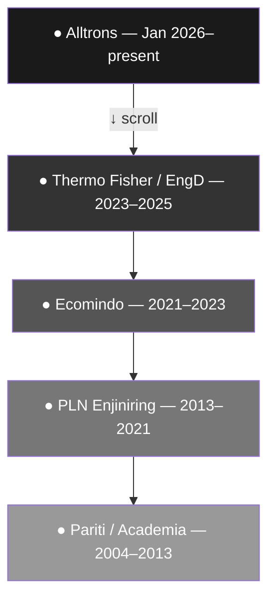
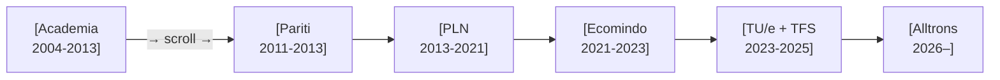

# ADR-0004: Career visualisation — how to render the stations as a map/journey in Phase 2

← [ADR index](../ADR.md)

**Status:** Proposed
**Drivers:** game-feel without a game engine · ship fast · no wasted work (same content model)
**Constrained by:** [ADR-0001](adr-0001.md) (render layer is disposable; content model is fixed)
· [ADR-0002](adr-0002.md) (Vite + React + TS; no game engine yet; HTML/CSS/SVG only in Phase 2)
· [ADR-0003](adr-0003.md) (Stations are the data; this ADR only decides how they look)

## What is a "career map"?

Right now the site renders each Station (career phase) as a block of text with bullet points —
the same shape as a CV. That is fully readable, but it has no visual sense of *journey* or
*progression*. A career map is a visual layout that makes the timeline feel like a path you
move through rather than a document you scroll past.

The **Stations already exist** in `src/content/stations.ts` — Alltrons, Thermo Fisher/EngD,
Ecomindo, PLN, Pariti, Academia. This ADR is purely about **how those Stations are drawn**.
Nothing in the content model changes; this is a Render-layer decision per
[ADR-0001](adr-0001.md).

Think of it this way: the same seven stations could be laid out as a vertical scroll, a
horizontal track, a metro-line map, or a node graph. Each reads exactly the same data; each
creates a very different feel.

## Context

[ROADMAP.md](../ROADMAP.md) Phase 2 specifies "an animated timeline/map of stations (still
HTML/CSS/SVG)" with click-to-expand project cards and a skill-tree/character-sheet component
for the recruiter lens. No game engine is allowed yet ([ADR-0002](adr-0002.md)).

The design question is: **what geometric metaphor** should the career use?

The choice matters because:
- It sets the *visual identity* visitors remember. The rendering is described as "disposable"
  ([ADR-0001](adr-0001.md)), but in practice the Phase-2 render is what most recruiters see
  before Phase-3 is finished — so it has real weight.
- Different metaphors have very different build costs (a straight vertical line is a day;
  a node-graph with physics is a week).
- The Phase-3 pixel-walker **already commits to a top-down grid** world. The Phase-2 visual
  should either set up that expectation or be honestly different.

## Prior art

### Already surveyed in ADR-0001 (not repeated in full here)

**Robby Leonardi — Interactive Resume (Mario side-scroller).**
[rleonardi.com/interactive-resume](http://www.rleonardi.com/interactive-resume/) —
Career as horizontal scrolling levels. The template for option B below (horizontal track).
*What we borrow:* the instinct that a career has a natural *left-to-right* reading direction.
*What differs:* Leonardi's track is a single path; the lens-filter mechanic means ours highlights
different stations per audience.

**hajj.buzz — Pixel journey, station-by-station.**
A top-down pixel walker that moves an avatar between named stations where NPCs deliver
explanations. *Directly borrowed for Phase 3.* For Phase 2, it proves that "station → expand →
content" is a legible mechanic for a general audience, even without a game engine.

**Peter Oravec — 8-bit neighbourhood.**
[peteroravec.com](https://peteroravec.com) — Top-down pixel neighbourhood; arrows move an
avatar to find CV and projects. *Template for Phase-3 grid world.* For Phase 2, it shows the
top-down node metaphor works even as a static layout.

### New references for the specific layout options

**Metro / subway map as resume** — The "[Metro CV](https://www.metrocv.com)" genre: career
phases as stations on a metro line, each node on a coloured route. Not a single authoritative
site, but a widely reproduced template format (Canva, Etsy, hundreds of designer portfolio
breakdowns). *Borrowed:* the station-on-a-line metaphor, which maps directly onto the project's
`Station` naming. *Explicit prior art for option C below.*

**RPG skill tree** — Passive skill trees in games like Path of Exile and Final Fantasy X, and
in the browser-based resumé generator
[rpg-rosy.vercel.app](https://rpg-rosy.vercel.app/) (open-source, MIT). *Borrowed:* the
"unlock as you grow" reading of a career arc; skills as nodes with edges. *Explicit prior art
for option D below.*

**LinkedIn's experience timeline** — The default web reading of every professional career:
vertical list, newest at top. The reference for option A below — not cited as inspiration but
as the *baseline* this project is explicitly trying to exceed.

---

## The four options

Each option is described in plain English first, then shown as a rough mermaid sketch.

---

### Option A — Vertical scrolling timeline (the enhanced CV)

**What it is:** The stations are laid out top-to-bottom, newest first, connected by a vertical
line. Clicking a station expands its project cards below it. This is the closest to what the
site already does — the upgrade is visual markers (dots, icons, a connecting line) and the
click-to-expand interaction.

**What it feels like:** A polished LinkedIn profile, not a game. Readable and fast to build,
but the least differentiated.

**Build cost:** Low — 1–2 days. CSS vertical line + dots + CSS expand animation.
**Differentiation:** Low — every timeline-resume looks like this.
**Phase-3 fit:** Neutral — doesn't set up or contradict the top-down pixel grid.

---

### Option B — Horizontal scrolling career track

**What it is:** The stations are laid out left-to-right like chapters of a story — or levels of
a game. You scroll (or swipe) sideways through time. Each station is a "chapter card"; project
cards appear below or beside the active station.

**What it feels like:** A Mario level, a book of chapters, a journey with a clear direction.
Closer to the hajj.buzz pixel-journey reading without needing a game engine.

**Build cost:** Medium — 2–3 days. Horizontal scroll container, scroll-snap on stations, CSS
transitions.
**Differentiation:** Medium — less common than vertical, but still a recognised pattern.
**Phase-3 fit:** Good — the left-to-right narrative maps onto the top-down world's "zones" in
a Phase-3 reframe.

---

### Option C — Metro / subway line map

**What it is:** Stations are literal stops on a metro line. Different "lines" (coloured tracks)
represent different capability areas — backend work on one line, PM/leadership on another,
embedded on a third. Career phases where multiple lines converge are shown as interchange
stations (the PLN node is the biggest interchange: backend + PM + leadership all meet there).

**What it feels like:** A London Tube map of Hasrul's career. Recruiters picking the QA lens
would see the QA-tagged stations highlighted; the other lines go grey. This is the most
visually original of the four options.

**Build cost:** High — 4–6 days. SVG paths for the lines, station nodes positioned on a grid,
lens-based highlighting logic. Real risk of over-engineering.
**Differentiation:** Very high — genuinely novel for a personal portfolio.
**Phase-3 fit:** Loose — the metro metaphor doesn't map cleanly onto a top-down tile world.
If Phase 3 is built, these two renders would feel like different products.

---

### Option D — Skill tree / character sheet

**What it is:** Not a timeline — a node graph. Skills are nodes; career phases are the edges
that "unlocked" them. Clicking a skill node shows which projects used it. The recruiter lens
filters which nodes are highlighted. This is more like an RPG character screen than a CV.

**What it feels like:** A game character sheet or Path of Exile's passive tree. The most
gamified of the four without a game engine.

**Build cost:** Medium-High — 3–5 days. D3.js or hand-coded SVG force graph, or simpler CSS
node-and-edge layout. Risk: needs careful layout tuning to avoid looking like a spider chart.
**Differentiation:** High — no personal portfolio does this well.
**Phase-3 fit:** Good — the skill-tree metaphor maps onto the "character stats" panel that the
Phase-3 pixel-walker could show when the avatar enters a zone.

---

## Summary of options

| Option | Feel | Build cost | Differentiates | Phase-3 fit |
|---|---|---|---|---|
| A — Vertical timeline | Enhanced CV | Low (1–2d) | Low | Neutral |
| B — Horizontal track | Career journey / chapters | Medium (2–3d) | Medium | Good |
| C — Metro map | Capability network | High (4–6d) | Very high | Loose |
| D — Skill tree | RPG character sheet | Medium-high (3–5d) | High | Good |

The options are not mutually exclusive — a common pattern would be **B as the macro layout**
(scroll through career chapters) with **D as the recruiter lens inset** (skill-tree panel within
the active station). That is the most likely Phase-2 + Phase-3 combination if no single option
wins outright.

## Decision

*Not yet made — pending Hasrul's direction.*

The decision driver is the product-judgment north star: the career map should require the least
build cost to demonstrate the most product insight. Option C is the most original but risks
Phase-3 incoherence; Option A is the safest but adds no differentiation over Phase 0. The
recommendation is **B + D** (horizontal journey macro layout + skill-tree inset for the
recruiter lens), but this is Hasrul's call before code is written.

## Alternatives ruled out before this ADR

- **3D scene** (Bruno Simon style) — Phase-2 rules say HTML/CSS/SVG only; game engine is Phase 3.
  *Deferred, not rejected.*
- **Calendar / Gantt heatmap** (GitHub contribution-graph style) — an interesting "activity density"
  read but has no narrative arc and is not audience-filterable. *Ruled out.*
- **Plain static image / infographic** — not interactive; doesn't let the viewer explore; doesn't
  demonstrate engineering skill. *Ruled out.*

## Consequences (once decided)

- The chosen render is still a **Render-layer decision** per [ADR-0001](adr-0001.md) — the same
  `stations.ts` / `projects.ts` / `lenses.ts` feed it unchanged.
- If the metro map (C) is chosen, expect a separate ADR on the SVG layout engine (D3 vs hand-coded).
- If the skill tree (D) is chosen, the `skills` field currently on `LensDef` is a flat string array —
  a graph would need a normalised skills entity (flagged as a known limit in
  [ADR-0003](adr-0003.md)).
- The Phase-3 pixel-walker game commits to a top-down grid world regardless of this choice;
  the Phase-2 render should not actively contradict that expectation (relevant for option C).
