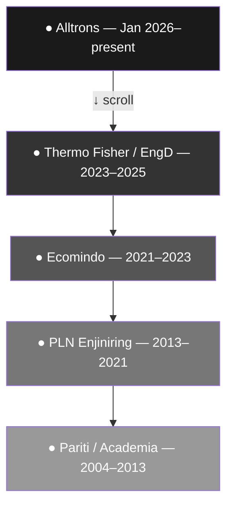
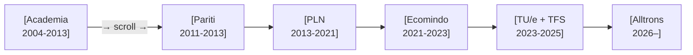
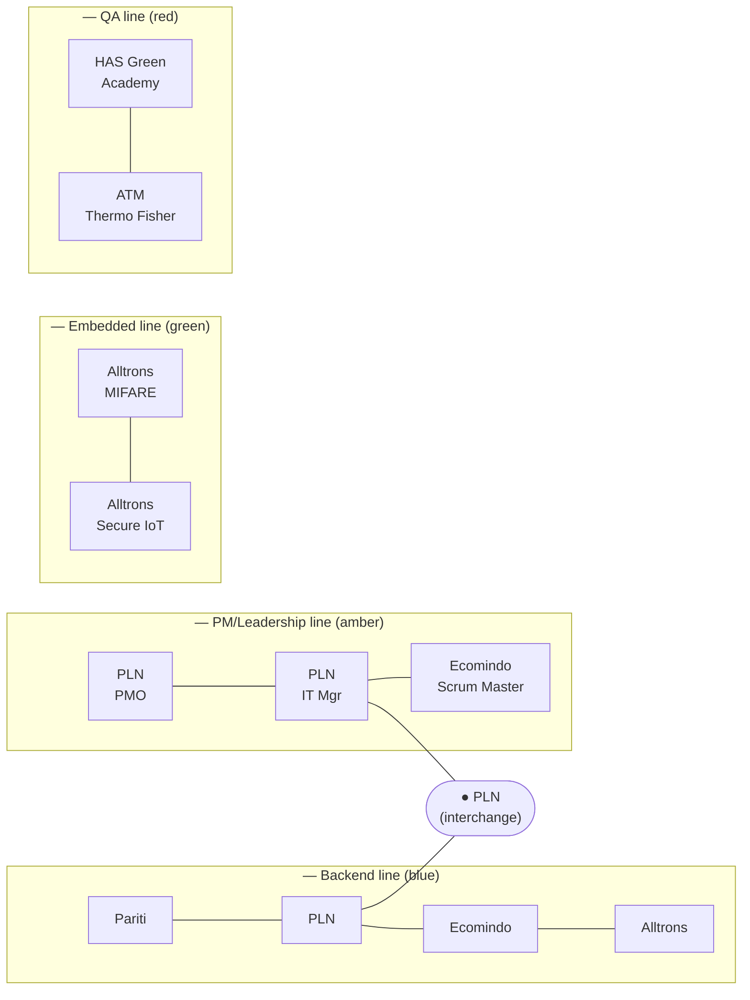
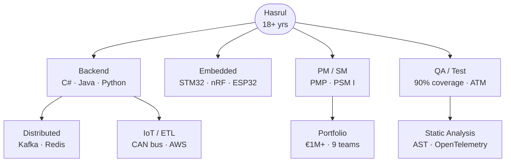

# ADR-0004: Career visualisation — how to render the stations on the readable site

← [ADR index](../ADR.md)

**Status:** Accepted (2026-06-20)
**Decision criteria (ranked):** ① **readability** · ② **Phase-3 (gamification) fit** · ③ ship fast / low build cost
**Constrained by:** [ADR-0001](adr-0001.md) (render layer is disposable; content model is fixed)
· [ADR-0002](adr-0002.md) (Vite + React + TS; no game engine yet; HTML/CSS/SVG only in Phase 2)
· [ADR-0003](adr-0003.md) (Stations are the data; this ADR only decides how they look)
· [ADR-0005](adr-0005.md) (the **game** now carries the *uniqueness/wow* burden — so this readable-site
  decision optimises for readability, not novelty)

## What is a "career map"?

Right now the site renders each Station (career phase) as a block of text with bullet points —
the same shape as a CV. That is fully readable, but it has no visual sense of *journey* or
*progression*. A career map is a visual layout that makes the timeline feel like a path you
move through rather than a document you scroll past.

The **Stations already exist** in `src/content/stations.ts` — Alltrons, Thermo Fisher/EngD,
Ecomindo, PLN, Pariti, Academia. This ADR is purely about **how those Stations are drawn**.
Nothing in the content model changes; this is a Render-layer decision per
[ADR-0001](adr-0001.md).

Think of it this way: the same seven stations could be laid out as a vertical scroll, a
horizontal track, a metro-line map, or a node graph. Each reads exactly the same data; each
creates a very different feel.

## Context

[ROADMAP.md](../ROADMAP.md) Phase 2 specifies "an animated timeline/map of stations (still
HTML/CSS/SVG)" with click-to-expand project cards and a skill-tree/character-sheet component
for the recruiter lens. No game engine is allowed yet ([ADR-0002](adr-0002.md)).

**Scope, after [ADR-0005](adr-0005.md):** this ADR decides the career layout for the **readable
site** only. [ADR-0005](adr-0005.md) made the *game* (Phase 3) the home of the journey/exploration
experience and the carrier of the site's *uniqueness*. That reassignment is what lets this decision
be made cleanly: the readable site no longer has to be the "wow" — it has to be the **fast, clear,
skimmable** path that a hurried recruiter (or an ATS-skimming human) can read in seconds. The
elaborate "journey" metaphors are the game's job, not the readable site's.

So the decision criteria, ranked:

1. **Readability (primary).** Can a visitor extract Hasrul's career — who, where, when, what mattered —
   quickly and without fighting the layout? This is what the readable site is *for*.
2. **Phase-3 (gamification) fit (secondary).** Does the layout set up, or at least not contradict, the
   top-down tile-world the game commits to? A tiebreaker, not an override.
3. **Ship fast / low build cost (tertiary).** Cheaper is better, all else equal.

**Uniqueness is deliberately *not* a top criterion here** — [ADR-0005](adr-0005.md) moved that burden
to the game. Optimising the readable site for novelty would duplicate (and compete with) the game's job.

## Prior art

### Already surveyed in ADR-0001 (not repeated in full here)

**Robby Leonardi — Interactive Resume (Mario side-scroller).**
[rleonardi.com/interactive-resume](http://www.rleonardi.com/interactive-resume/) —
Career as horizontal scrolling levels. The template for option B below (horizontal track).
*What we borrow:* the instinct that a career has a natural *left-to-right* reading direction.
*What differs:* Leonardi's track is a single path; the lens-filter mechanic means ours highlights
different stations per audience.

**hajj.buzz — Pixel journey, station-by-station.**
A top-down pixel walker that moves an avatar between named stations where NPCs deliver
explanations. *Directly borrowed for Phase 3.* For Phase 2, it proves that "station → expand →
content" is a legible mechanic for a general audience, even without a game engine.

**Peter Oravec — 8-bit neighbourhood.**
[peteroravec.com](https://peteroravec.com) — Top-down pixel neighbourhood; arrows move an
avatar to find CV and projects. *Template for Phase-3 grid world.* For Phase 2, it shows the
top-down node metaphor works even as a static layout.

### New references for the specific layout options

**Metro / subway map as resume** — A widely reproduced resume template format: career phases
as stops on a metro line, each node on a coloured route. No single authoritative site; the
pattern appears across Canva template libraries, designer portfolio breakdowns on Behance and
Dribbble, and the "metro resume" category on Etsy. *Borrowed:* the station-on-a-line metaphor,
which maps directly onto the project's `Station` naming. *Explicit prior art for option C below.*

**RPG skill tree** — Passive skill trees in games like Path of Exile and Final Fantasy X, and
in the browser-based resumé generator
[rpg-rosy.vercel.app](https://rpg-rosy.vercel.app/) (open-source, MIT). *Borrowed:* the
"unlock as you grow" reading of a career arc; skills as nodes with edges. *Explicit prior art
for option D below.*

**LinkedIn's experience timeline** — The default web reading of every professional career:
vertical list, newest at top. The reference for option A below — not cited as inspiration but
as the *baseline* this project is explicitly trying to exceed.

---

## The four options

Each option is described in plain English first, then shown as a rough mermaid sketch.

---

### Option A — Vertical scrolling timeline (the enhanced CV)

**What it is:** The stations are laid out top-to-bottom, newest first, connected by a vertical
line. Clicking a station expands its project cards below it. This is the closest to what the
site already does — the upgrade is visual markers (dots, icons, a connecting line) and the
click-to-expand interaction.

**What it feels like:** A polished LinkedIn profile, not a game. Readable and fast to build,
but the least differentiated.

**Readability:** **High** — natural top-to-bottom reading order, scannable at a glance, works on
mobile without horizontal scroll. The most readable of the four.
**Phase-3 fit:** Neutral — doesn't set up or contradict the top-down pixel grid.
**Build cost:** Low — 1–2 days. CSS vertical line + dots + CSS expand animation.
**Uniqueness:** Low — every timeline-resume looks like this *(deprioritised — see criteria)*.

---

### Option B — Horizontal scrolling career track

**What it is:** The stations are laid out left-to-right like chapters of a story — or levels of
a game. You scroll (or swipe) sideways through time. Each station is a "chapter card"; project
cards appear below or beside the active station.

**What it feels like:** A Mario level, a book of chapters, a journey with a clear direction.
Closer to the hajj.buzz pixel-journey reading without needing a game engine.

**Readability:** **Low** — horizontal scroll fights the natural reading direction, hides how much
content remains, and is awkward on mobile and with a mouse wheel. Reading dense career text sideways
is the weakest of the four.
**Phase-3 fit:** Good — the left-to-right narrative maps onto the top-down world's "zones" in
a Phase-3 reframe.
**Build cost:** Medium — 2–3 days. Horizontal scroll container, scroll-snap on stations, CSS
transitions.
**Uniqueness:** Medium — less common than vertical, but still a recognised pattern.

---

### Option C — Metro / subway line map

**What it is:** Stations are literal stops on a metro line. Different "lines" (coloured tracks)
represent different capability areas — backend work on one line, PM/leadership on another,
embedded on a third. Career phases where multiple lines converge are shown as interchange
stations (the PLN node is the biggest interchange: backend + PM + leadership all meet there).

**What it feels like:** A London Tube map of Hasrul's career. Recruiters picking the QA lens
would see the QA-tagged stations highlighted; the other lines go grey. This is the most
visually original of the four options.

**Readability:** **Low** — it's a diagram you *decode*, not text you *read*. Great for a "wow" glance,
slow for actually extracting the career (which line is which, where do they cross, what happened when).
Fails the primary criterion.
**Phase-3 fit:** Loose — the metro metaphor doesn't map cleanly onto a top-down tile world.
If Phase 3 is built, these two renders would feel like different products.
**Build cost:** High — 4–6 days. SVG paths for the lines, station nodes positioned on a grid,
lens-based highlighting logic. Real risk of over-engineering.
**Uniqueness:** Very high — but *(per [ADR-0005](adr-0005.md), uniqueness is the game's job, not the
readable site's — so this no longer counts in its favour here)*.

---

### Option D — Skill tree / character sheet

**What it is:** Not a timeline — a node graph. Skills are nodes; career phases are the edges
that "unlocked" them. Clicking a skill node shows which projects used it. The recruiter lens
filters which nodes are highlighted. This is more like an RPG character screen than a CV.

**What it feels like:** A game character sheet or Path of Exile's passive tree. The most
gamified of the four without a game engine.

**Readability:** **Low–Medium** as a *career* layout — a node graph is exploratory, not linearly
readable; you can't skim a career narrative from it. But it reads well for its *actual* purpose:
showing **skill breadth at a glance** for the recruiter lens. So it's a poor main layout but a strong
*optional component*.
**Phase-3 fit:** Good — the skill-tree metaphor maps onto the "character stats" panel that the
Phase-3 pixel-walker could show when the avatar enters a zone.
**Build cost:** Medium-High — 3–5 days. D3.js or hand-coded SVG force graph, or simpler CSS
node-and-edge layout. Risk: needs careful layout tuning to avoid looking like a spider chart.
**Uniqueness:** High — no personal portfolio does this well.

---

## Summary of options

Ranked by the primary criterion (readability) first:

| Option | Readability (①) | Phase-3 fit (②) | Build cost (③) | Uniqueness *(not a criterion here)* |
|---|---|---|---|---|
| **A — Vertical timeline** | **High** | Neutral | Low (1–2d) | Low |
| B — Horizontal track | Low | Good | Medium (2–3d) | Medium |
| C — Metro map | Low | Loose | High (4–6d) | Very high |
| D — Skill tree | Low–Medium (good for *skills*, poor for *career*) | Good | Medium-high (3–5d) | High |

## Decision

**The readable site uses Option A — the vertical scrolling timeline.** It wins the primary criterion
outright (most readable, scannable, mobile-friendly), is Phase-3-neutral on the secondary criterion,
and is the cheapest to build. For a readable site whose job is *fast, clear comprehension* — not wow —
A is the honest fit.

**Why readability wins — empathy for the time-poor visitor.** The deeper reason readability is ranked
first is a guess about who actually shows up: a recruiter, founder, or owner is often busy and may have
no appetite to play the full game. [ADR-0005](adr-0005.md) makes the game skippable precisely so they
can cut it short and *get to the business* — and the place they land when they skip is this readable
site. So the readable layout must reward the visitor who has thirty seconds, not three minutes: who is
he, where, when, what mattered — extractable at a glance. A vertical timeline serves that visitor; a
horizontal track or a metro map makes them work for it. Choosing the layout around the hurried
visitor's constraints is itself the product judgment this whole site is meant to demonstrate —
understand the user, then ship for them.

**Option D (skill tree) is built alongside A — as the recruiter lens's *Skills* section**, not as
the career spine. The placement emerged from running both in the actual UI (A/B comparison in
`RecruiterView`): D at the top of the recruiter view as a "skill breadth at a glance" panel, A at the
bottom as the full career arc. They complement rather than compete — D answers "what can he do?" in a
scannable node list; A answers "where has he been and how long?" in a linear scroll. Each does one job
cleanly; neither tries to do both. D earns its place on the secondary criterion (good Phase-3 fit — it
becomes the game's character-stats panel) and on its actual strength (skill-breadth clarity at a glance),
while staying out of the way of readability because it is a distinct, named section, not the spine of
the page. The A/B comparison confirmed the combination is better than either alone.

**Options B and C are dropped:**
- **B (horizontal track)** loses the primary criterion — sideways reading of dense career text is the
  worst of the four. Its one strength (Phase-3 journey fit) is now redundant: the *game* is the journey
  ([ADR-0005](adr-0005.md)), so the readable site doesn't need to imitate one.
- **C (metro map)** also loses readability (a decode-not-read diagram) and its headline strength —
  uniqueness — no longer counts here, because [ADR-0005](adr-0005.md) made uniqueness the game's job.
  Its Phase-3 fit is loose. Nothing left to recommend it for the readable site.

This is the decision [ADR-0005](adr-0005.md) unlocked: once the game owns the journey and the wow,
the readable-site layout question collapses to "what reads fastest?" — and that is A.

## Alternatives ruled out before this ADR

- **3D scene** (Bruno Simon style) — Phase-2 rules say HTML/CSS/SVG only; game engine is Phase 3.
  *Deferred, not rejected.*
- **Calendar / Gantt heatmap** (GitHub contribution-graph style) — an interesting "activity density"
  read but has no narrative arc and is not audience-filterable. *Ruled out.*
- **Plain static image / infographic** — not interactive; doesn't let the viewer explore; doesn't
  demonstrate engineering skill. *Ruled out.*

## Consequences

- **Phase 2 builds A and D together**: both are Render-layer components feeding off the same
  `stations.ts` / `projects.ts` / `lenses.ts` ([ADR-0001](adr-0001.md), [ADR-0003](adr-0003.md)).
  Combined build cost was within the 1–3 day range; the A/B comparison added no waste since both were
  always the shortlist.
- **A (vertical timeline) is built as `src/components/Timeline.tsx`** — the career-arc spine of
  `RecruiterView`. Stations from `src/content/stations.ts`; click-to-expand; no new infrastructure.
  Stays inside [ADR-0002](adr-0002.md)'s HTML/CSS constraint.
- **D (skill tree) is built as `src/components/SkillTree.tsx`** — the recruiter lens's *Skills*
  section in `RecruiterView`, above the project list and the timeline. Skills shown are derived from the
  lens's filtered projects' `tech` arrays; career-wide proof counts come from
  `src/content/techIndex.generated.ts` (crawled by `scripts/build-projects.mjs`). The `skills` field on
  `LensDef` remains a flat string array — a normalised skills graph would require a new ADR, known limit
  flagged in [ADR-0003](adr-0003.md). D also templates Phase 3's character-stats panel.
- **B and C will not be built.** If a future reason to revive the metro/journey idea appears, it is a
  *new* ADR — these options are recorded here as considered-and-rejected, not as backlog.
- **No new infrastructure**: A is plain CSS/HTML; no SVG layout engine, no D3, no game engine — stays
  inside [ADR-0002](adr-0002.md).
- The Phase-3 pixel-walker still commits to a top-down grid world; A is neutral to it, so nothing here
  contradicts that future.
