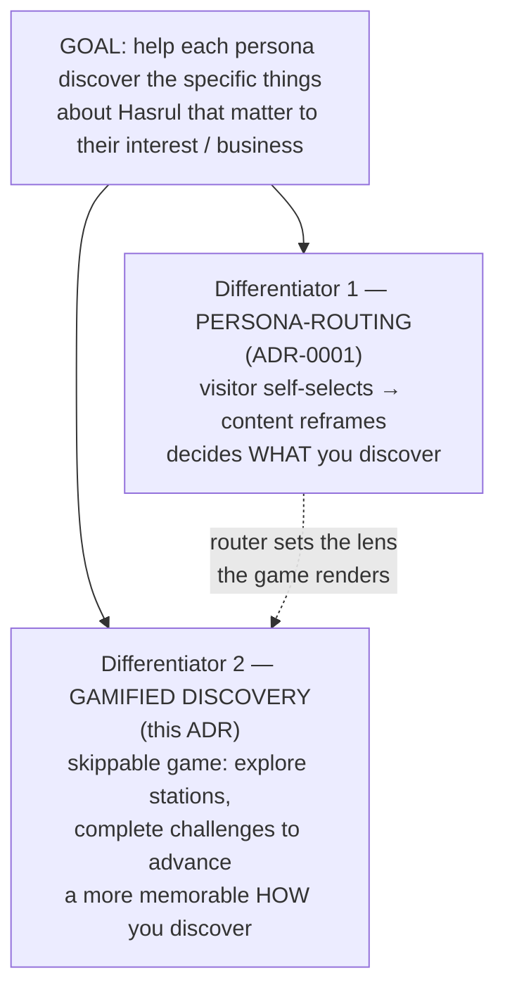

# ADR-0005: Differentiation thesis — persona-routing *and* gamified discovery, both in service of persona-specific discovery

← [ADR index](../ADR.md)

**Status:** Accepted (2026-06-20)
**Extends:** [ADR-0001](adr-0001.md) (sharpens its differentiator framing; does not reverse it)
**Drivers:** stand out among professional personal sites · product judgment over graphics-wow ·
one goal governs every feature
**Feeds:** [ROADMAP.md](../ROADMAP.md) · reframes [ADR-0004](adr-0004.md)

## Context

[ADR-0001](adr-0001.md) named **one** differentiator — the persona-router — and explicitly
de-prioritised visuals (*"product judgment, not engineering wow … the differentiator is the
persona-router, not graphics"*). That call about *graphics-flex* was right and still stands.

But two things have become clearer since:

1. **A persona-router rendered as a readable site may not be memorable enough on its own.**
   A great many professionals have personal sites that promote their profile. Audience-routing is
   genuinely novel (ADR-0001's survey found no portfolio that does it), but a visitor who only ever
   sees clean typographic pages may not *remember* the experience — and being remembered is the point
   of standing out.

2. **The reference site does more than route.** Hasrul's model is **hajj.buzz**, which ships **two
   modes that share one visual identity** — a readable content site *and* a game — where the **game**
   is the memorable part. Crucially, hajj.buzz's game goes beyond "walk an avatar around and talk to
   NPCs": it gates progress behind **challenges** the visitor completes to advance from station to
   station.

This forces a sharper statement of **what the whole site is for**. Hasrul's stated goal:

> **Help each persona find out the specific things about Hasrul that matter to *their* interest or
> business.**

Both the router and the game serve that one goal. The router decides *what* a given visitor should
discover; the game is a more engaging *how*. Neither is decoration; both are discovery mechanics.

## Decision

The site has **two co-differentiators**, and **one goal governs both**:

1. **Persona-routing** — unchanged from [ADR-0001](adr-0001.md). The visitor self-selects a persona
   (and, for recruiters, a role lens); the content reframes around them.
2. **Gamified discovery** — a **skippable** game mode in which the persona explores Hasrul's career as
   stations and **completes challenges to advance** between them, discovering the things relevant to
   their lens along the way. The challenge-to-advance mechanic — not just walk-and-talk — is what
   pushes past hajj.buzz and the rest of the gamified-resume genre.

**One shared visual identity** (colour palette, typography, motifs) spans both the readable site and
the game, so the two modes read as a single product — the way hajj.buzz binds its content site and game
together.

### How this relates to ADR-0001 (extends, does not contradict)

- **"Not engineering-wow / not graphics-flex" still holds.** The game is a *product and discovery
  mechanic*, not a graphics showcase. Effort goes to the router and the challenge design, **not** to 3D
  eye-candy. [ADR-0001](adr-0001.md)'s rejection of the Bruno-Simon graphics path is unchanged — see
  *Prior art / what we did not borrow*.
- **"Game-optional" still holds.** The readable, persona-routed site remains canonical and always
  reachable; the game is skippable (the "skip to text" escape hatch). What changes: the game is now
  recognised as the primary **memorability** differentiator, not a disposable end-of-roadmap skin.
- **Refines "the render layer is disposable."** A *specific* skin is still swappable
  ([ADR-0001](adr-0001.md) layer 3). But *having a game mode at all* is now a strategic, load-bearing
  decision — not optional decoration. The three-layer separation is what makes this safe: the router
  and content ("the brain") are untouched whether the skin is a page or a game.

## Prior art

**hajj.buzz — two-mode site (content + game), shared identity, challenge-gated progression.**
*Borrowed directly:* the dual-mode model, the single shared visual identity across both modes, and —
the new piece — **challenges that gate advancement between stations**, not just NPC dialogue. *Differs:*
hajj.buzz teaches one fixed subject to every visitor; here the discovery is **persona-specific** — the
router chooses which facts matter, so two visitors playing the same game pursue different goals.

**Gamified-resume genre** (Robby Leonardi's Mario side-scroller, Peter Oravec's 8-bit neighbourhood —
both surveyed in [ADR-0001](adr-0001.md)). *Borrowed:* the proof that a game-framed career is memorable
and credible. *Differs:* none combine the game with **persona-routing** or with **challenge-gated,
audience-specific discovery** — that intersection is the contribution.

**What we did *not* borrow — and won't.** The 3D graphics-flex path (Bruno Simon). [ADR-0001](adr-0001.md)
rejected it as rewarding graphics skill over product judgment; this ADR reaffirms that. "Gamified" here
means *mechanic*, not *render budget*.

## Alternatives considered

- **Keep the persona-router as the sole differentiator** (ADR-0001 unchanged) — simplest, but risks not
  being memorable enough to stand out among the many professional personal sites. *Rejected as
  insufficient for the "stand out" goal.*
- **Make the game the only mode** (drop the readable site) — maximal novelty, but breaks the
  content-first / skip-path requirement that [ADR-0001](adr-0001.md) still binds; loses hurried
  recruiters. *Rejected.*
- **Graphics-wow flex as the differentiator** (3D/WebGL spectacle) — high ceiling, wrong axis; rewards
  engineering-wow over product judgment. *Rejected (consistent with [ADR-0001](adr-0001.md)).*
- **Gamify without challenges** (walk-and-talk only, like the base hajj.buzz mechanic) — pleasant but
  not differentiated; the challenge-to-advance loop is what makes it stick. *Rejected as too thin.*

## Consequences

- **The game (with the challenge mechanic) is now a strategic centrepiece**, not a nice-to-have at the
  end of the roadmap. [ROADMAP.md](../ROADMAP.md) Phases 2–3 and the north-star line are updated to
  reflect the two-differentiator thesis in the same pass as this ADR.
- **A new decision is owed: what the challenges *are*.** They must serve the goal — making a persona
  *discover role-relevant facts about Hasrul* — not generic trivia. The challenge content is sourced
  from the verified career facts in `%HASRUL_PROFILE%` (per-lens material, flagship stories, capability
  areas), bound by the §A/§E honesty rules. *Deferred to a future ADR before any game code is written.*
- **Shared visual identity becomes a real requirement** (palette + type across site and game). This is
  now the *primary* job of the Phase-2 work — ahead of any specific career-map layout.
- **[ADR-0004](adr-0004.md) is reframed.** The career-visualisation options there are part of the
  discovery/game layer, and *persona-specific discovery* is now an explicit criterion for choosing among
  them — alongside build-cost, uniqueness, and Phase-3 fit.
- **The readable site likely gets a light visual reskin** to share the game's identity (this answers
  Hasrul's open question of whether to upgrade the current site mode). Recommendation: a reskin to share
  palette/type, **not** a structural rebuild — the [ADR-0003](adr-0003.md) content model and the Phase-1
  router stay exactly as they are.
- **Supersede trigger:** if the challenge mechanic proves to add no measurable engagement (Phase-4
  analytics) or to cost more than it returns, a future ADR may demote the game back to optional
  decoration — recorded as a new ADR, never an in-place edit here.
